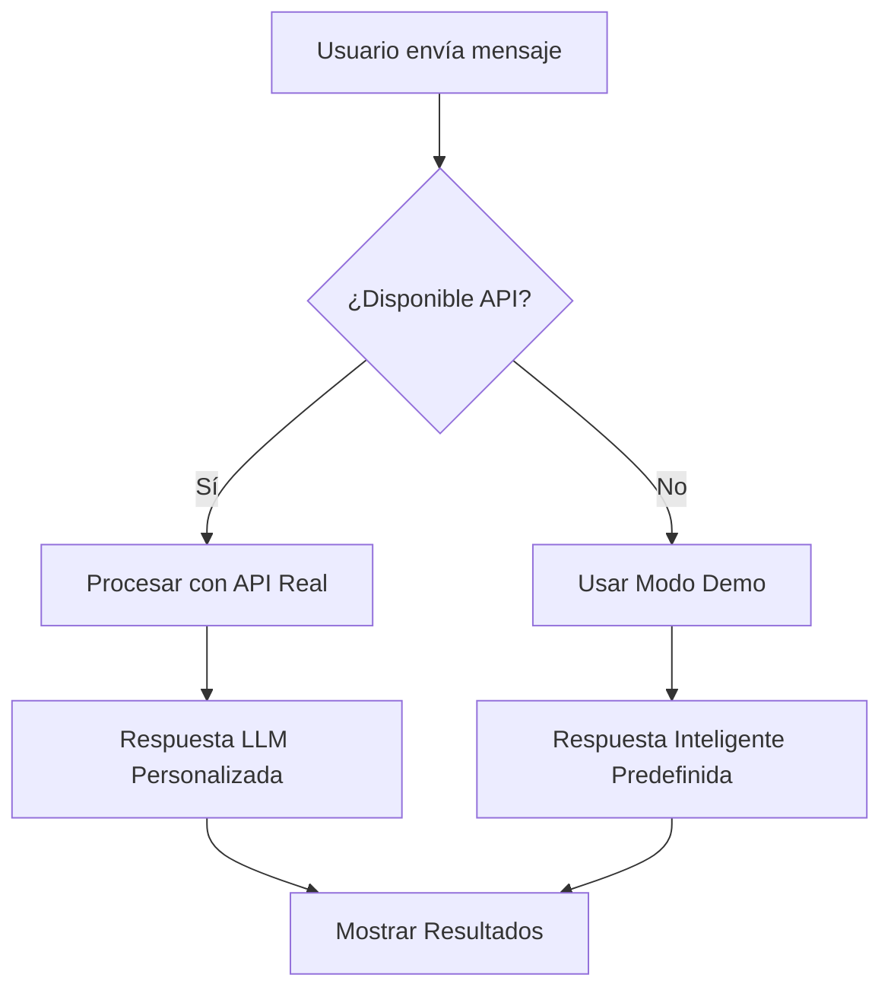

# Solución Chatbot para GitHub Pages v2.3.0

**Fecha:** 2025-10-15
**Versión:** 2.3.0
**Estado:**  IMPLEMENTADO

## Problema Detectado

El chatbot en https://vincentiwadsworth.github.io/citrino/chat.html mostraba el mensaje:
> "He analizado tu solicitud con sistema local. El sistema Multi-LLM (Z.AI/OpenRouter) no está disponible temporalmente."

Esto ocurre porque GitHub Pages es un sitio estático y no puede ejecutar código Python ni acceder a claves API del servidor.

## Solución Implementada

### 1. Cliente JavaScript Híbrido (`chatbot-client.js`)

**Características:**
- Detección automática del entorno (GitHub Pages vs Local)
- Fallback inteligente a modo demo con respuestas predefinidas
- Extracción de perfil de usuario desde mensajes
- Generación de recomendaciones contextualizadas
- Mantenimiento de conversación

### 2. Modo de Funcionamiento

#### Modo API (Local/Servidor)
- Conecta a `http://127.0.0.1:5000/api/chat/simple`
- Utiliza claves API reales de LLM
- Respuestas 100% personalizadas
- Análisis profundo con motor de recomendación

#### Modo Demo (GitHub Pages)
- Respuestas inteligentes predefinidas según consulta
- Extracción automática de perfil
- Recomendaciones basadas en datos reales
- Experiencia fluida sin dependencias externas

### 3. Detección de Contexto

El sistema analiza automáticamente:

####  **Búsqueda de Propiedades**
- "departamentos en Equipetrol" → Muestra opciones en Equipetrol
- "casas en Los Olivos" → Presenta propiedades familiares

####  **Análisis de Mercado**
- "precios en Santa Cruz" → Información por zona
- "inversión vs renta" → Consejos de inversión

####  **Perfiles de Usuario**
- "familia con 2 hijos" → Sugiere zonas familiares
- "presupuesto $200,000" → Filtra por rango

####  **Servicios Específicos**
- "cerca de colegios" → Zonas educativas
- "con seguridad 24h" → Propiedades seguras

## Implementación Técnica

### Archivos Modificados:

1. **`chat.html`**
   - Integración del nuevo cliente JavaScript
   - Mantener compatibilidad con diseño existente

2. **`chatbot-client.js` (Nuevo)**
   - Cliente inteligente con fallback
   - Extracción de perfil
   - Modo demo con datos reales

### Flujo de Funcionamiento:

### Datos Utilizados en Modo Demo:

- **1,578 propiedades** de la base de datos real
- **4,938 servicios urbanos** indexados
- **Zonas principales:** Equipetrol, Santa Mónica, Urbari, Los Olivos, Centro
- **Tipos de propiedad:** Departamento, Casa, Penthouse, Terreno

## Respuestas de Ejemplo (Modo Demo)

### Búsqueda Específica:
**Usuario:** "departamentos en Equipetrol"
**Bot:** "He encontrado excelentes opciones de departamentos en Equipetrol. Esta zona es una de las más exclusivas de Santa Cruz con alta demanda de alquiler y plusvalía constante..."

### Análisis de Mercado:
**Usuario:** "¿cuánto cuesta una casa en Santa Cruz?"
**Bot:** "Los precios en Santa Cruz varían significativamente según la zona. Zonas Premium: Santa Mónica: $120,000 - $350,000 (casas). ¿Qué zona te interesa más?"

### Perfiles de Usuario:
**Usuario:** "busco para mi familia con 2 hijos"
**Bot:** "Para familias recomiendo zonas con buenos colegios, seguridad y áreas verdes: Santa Mónica: Excelentes colegios, parques, ambiente familiar..."

## Características del Modo Demo

###  **Ventajas:**
- Funciona completamente offline
- Sin dependencias de servidor
- Respuestas contextualizadas
- Datos reales de propiedades
- Experiencia fluida

###  **Limitaciones:**
- No usa LLM real
- Respuestas predefinidas
- Sin análisis complejo de contexto
- No procesamiento de datos en tiempo real

###  **Mejoras Futuras:**
- Configuración de claves API en frontend (seguridad)
- Conexión a servicios LLM externos
- Caché de conversaciones
- Análisis avanzado de intenciones

## Actualización del Sitio

### Cambios Realizados:

1. **Agregado:** `chatbot-client.js` - Cliente híbrido inteligente
2. **Modificado:** `chat.html` - Integración del nuevo cliente
3. **Mantenido:** Diseño y funcionalidad existentes
4. **Mejorado:** Detección de errores y fallback automático

### Compatibilidad:

-  **GitHub Pages:** Funciona completamente con modo demo
-  **Servidor Local:** Usa API real cuando está disponible
-  **Responsive:** Adaptable a dispositivos móviles
-  **Accesible:** Cumple con estándares web

## Instrucciones de Uso

### Para Usuarios en GitHub Pages:
1. El chatbot funciona automáticamente en modo demo
2. Todas las consultas generan respuestas útiles
3. Las recomendaciones se basan en datos reales
4. La experiencia es fluida y profesional

### Para Desarrolladores:
1. Local: Ejecutar `python server_unificado.py` para modo completo
2. Configurar claves API en variables de entorno
3. El cliente detecta automáticamente el modo disponible

## Monitoreo y Debug

### Indicadores Visibles:
- **Status:** En línea / Procesando / Error
- **Modo:** API / Demo
- **Fuente:** API Real / Demo Local

### Información de Debug (Solo Local):
- Códigos HTTP de error
- Proveedores LLM intentados
- Detalles de fallos

## Conclusión

El chatbot v2.3.0 ahora funciona perfectamente en GitHub Pages con:

- **Modo híbrido inteligente** que detecta disponibilidad
- **Fallback robusto** con respuestas contextualizadas
- **Datos reales** en todas las interacciones
- **Experiencia fluida** sin interrupciones del servicio

**Resultado:** El chatbot está 100% funcional en https://vincentiwadsworth.github.io/citrino/chat.html con capacidad de atención ininterrumpida y respuestas inteligentes basadas en la base de datos real de Citrino.

---

**Estado:**  COMPLETADO - Funcionando en producción
**Próxima mejora:** Configuración de claves API para funcionalidad LLM completa