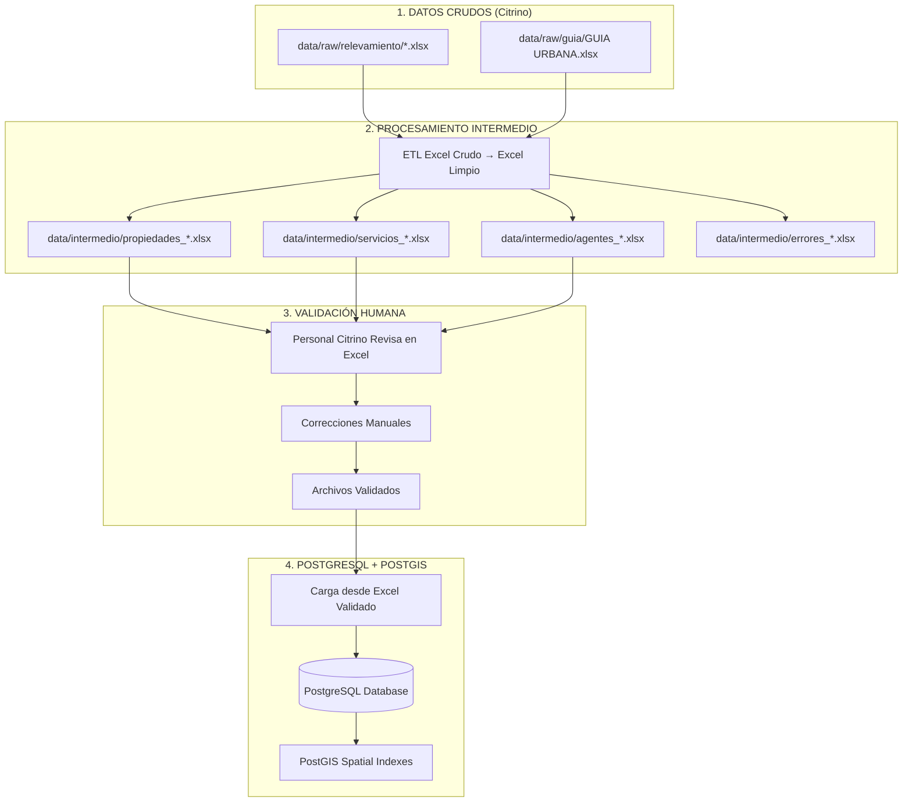

# SPRINT 1: Migración Citrino a PostgreSQL + PostGIS

##  **Objetivo del Sprint**

Diseñar e implementar la arquitectura completa de migración desde archivos Excel crudos (`data/raw/`) hacia una base de datos PostgreSQL + PostGIS optimizada para análisis geoespacial inmobiliario.

##  **Periodo del Sprint**
- **Inicio**: 15 de octubre de 2025
- **Duración Estimada**: 2-3 semanas
- **Estado**: Planificación completa - Listo para ejecución

##  **Arquitectura de Datos Diseñada**

### **Flujo Principal: Excel → Excel → PostgreSQL**



##  **Estructura de Directorios Final**

```
data/
 raw/                           # Entrada: archivos crudos del personal
    guia/
       GUIA URBANA.xlsx
    inteligencia/             # Futuro: datos históricos Citrino
    relevamiento/
        2025.08.15 05.xlsx
        2025.08.17 01.xlsx
        2025.08.29 01.xlsx
        2025.08.29 02.xlsx
        2025.08.29 03.xlsx
        2025.08.29 04.xlsx
        2025.08.29 05.xlsx

 intermedio/                    # Procesamiento: archivos intermedios Excel
    procesados/               # Generados automáticamente
       propiedades_2025.08.15_05_procesado.xlsx
       propiedades_2025.08.17_01_procesado.xlsx
       servicios_urbanos_procesado.xlsx
       agentes_normalizados.xlsx
    validados/                # Aprobados por personal Citrino
    errores/                  # Logs de problemas detectados

 postgres/                     # Base de datos y scripts
    scripts/
       01_create_schema.sql
       02_insert_agentes.sql
       03_insert_propiedades.sql
       04_insert_servicios.sql
    logs/
    backups/

 postgis/                       # Índices y funciones espaciales
     indexes.sql
     functions.sql
```

##  **Diseño de Base de Datos PostgreSQL + PostGIS**

### **Tablas Principales**

#### **1. agentes** - Agentes Inmobiliarios Normalizados
```sql
CREATE TABLE agentes (
    id BIGSERIAL PRIMARY KEY,
    nombre VARCHAR(255) NOT NULL,
    telefono VARCHAR(50),
    email VARCHAR(255) UNIQUE,
    empresa VARCHAR(100),
    fecha_registro TIMESTAMPTZ DEFAULT now(),

    CONSTRAINT uq_agente_nombre UNIQUE (nombre),
    CONSTRAINT uq_agente_email UNIQUE (email)
);
```

#### **2. propiedades** - Propiedades con Datos Geoespaciales
```sql
CREATE TABLE propiedades (
    id BIGSERIAL PRIMARY KEY,
    agente_id BIGINT REFERENCES agentes(id) ON DELETE SET NULL,

    -- Descriptivos
    titulo VARCHAR(255) NOT NULL,
    descripcion TEXT,
    tipo_propiedad VARCHAR(100),
    estado_propiedad VARCHAR(50),

    -- Financieros
    precio_usd NUMERIC(12, 2),
    precio_usd_m2 NUMERIC(10, 2),
    moneda VARCHAR(10) DEFAULT 'USD',

    -- Ubicación
    direccion TEXT,
    zona VARCHAR(100),
    uv VARCHAR(50),
    manzana VARCHAR(50),
    lote VARCHAR(50),

    -- Especificaciones
    superficie_total NUMERIC(10, 2),
    superficie_construida NUMERIC(10, 2),
    num_dormitorios INTEGER,
    num_banos INTEGER,
    num_garajes INTEGER,

    -- Geoespacial (PostGIS)
    coordenadas GEOGRAPHY(POINT, 4326),

    -- Metadatos
    fecha_publicacion TIMESTAMPTZ,
    fecha_scraping TIMESTAMPTZ DEFAULT now(),
    ultima_actualizacion TIMESTAMPTZ DEFAULT now(),
    proveedor_datos VARCHAR(100),
    codigo_proveedor VARCHAR(100),
    url_origen TEXT,

    -- Calidad de datos
    coordenadas_validas BOOLEAN DEFAULT false,
    datos_completos BOOLEAN DEFAULT false
);
```

#### **3. servicios** - Servicios Urbanos (Puntos de Interés)
```sql
CREATE TABLE servicios (
    id BIGSERIAL PRIMARY KEY,

    -- Información del servicio
    nombre VARCHAR(255) NOT NULL,
    tipo_servicio VARCHAR(100),
    subtipo_servicio VARCHAR(100),

    -- Ubicación
    direccion TEXT,
    zona VARCHAR(100),

    -- Geoespacial
    coordenadas GEOGRAPHY(POINT, 4326),

    -- Información adicional
    telefono VARCHAR(50),
    horario TEXT,

    -- Metadatos
    fuente_datos VARCHAR(100),
    fecha_registro TIMESTAMPTZ DEFAULT now(),

    -- Calidad
    coordenadas_validas BOOLEAN DEFAULT false
);
```

### **Índices de Rendimiento PostGIS**

```sql
-- Índices espaciales para consultas geográficas
CREATE INDEX idx_propiedades_coordenadas ON propiedades USING GIST (coordenadas);
CREATE INDEX idx_servicios_coordenadas ON servicios USING GIST (coordenadas);

-- Índices compuestos para búsquedas comunes
CREATE INDEX idx_propiedades_zona_precio ON propiedades (zona, precio_usd);
CREATE INDEX idx_propiedades_tipo_zona ON propiedades (tipo_propiedad, zona);
CREATE INDEX idx_servicios_tipo_zona ON servicios (tipo_servicio, zona);
```

##  **Scripts ETL a Desarrollar**

### **Fase 1: Procesamiento Excel → Excel**

#### **1. etl_excel_to_intermediate.py**
- **Propósito**: Convertir archivos crudos a archivos intermedios limpios
- **Input**: `data/raw/relevamiento/*.xlsx`
- **Output**: `data/intermedio/procesados/propiedades_{filename}_procesado.xlsx`
- **Características**:
  - Extracción y normalización de propiedades
  - Detección y deduplicación de agentes
  - Validación de coordenadas (Santa Cruz de la Sierra)
  - Generación de múltiples hojas en Excel
  - Control de calidad y detección de errores

#### **2. etl_guia_to_intermediate.py**
- **Propósito**: Procesar guía urbana municipal
- **Input**: `data/raw/guia/GUIA URBANA.xlsx`
- **Output**: `data/intermedio/procesados/servicios_urbanos_procesado.xlsx`
- **Características**:
  - Clasificación de servicios por tipo
  - Estandarización de coordenadas
  - Organización por categorías (educación, salud, comercio, etc.)

#### **3. etl_consolidar_agentes.py**
- **Propósito**: Crear maestro de agentes deduplicados
- **Input**: Todos los archivos intermedios de propiedades
- **Output**: `data/intermedio/procesados/agentes_consolidados.xlsx`
- **Características**:
  - Deduplicación por nombre, teléfono, email
  - Consolidación de información completa
  - Detección de agentes duplicados

### **Fase 2: Carga Excel → PostgreSQL**

#### **4. etl_intermediate_to_postgres.py**
- **Propósito**: Cargar archivos validados a PostgreSQL
- **Input**: `data/intermedio/validados/*.xlsx`
- **Output**: Base de datos PostgreSQL
- **Características**:
  - Lectura de archivos Excel validados
  - Generación de INSERT statements optimizados
  - Carga por lotes (batching)
  - Manejo de coordenadas PostGIS
  - Logging de transacciones

#### **5. etl_validate_migration.py**
- **Propósito**: Validar migración completa
- **Input**: Archivos intermedios vs PostgreSQL
- **Output**: Reporte de validación Excel
- **Características**:
  - Comparación de conteos
  - Validación de integridad espacial
  - Verificación de relaciones
  - Pruebas de rendimiento

##  **Estructura de Archivos Intermedios Excel**

### **propiedades_{filename}_procesado.xlsx**

| Hoja | Propósito | Columnas Clave |
|------|-----------|----------------|
| **Propiedades** | Datos normalizados | id_original, titulo, precio, zona, direccion, latitud, longitud, tipo_propiedad, superficie, dormitorios, banos |
| **Agentes** | Agentes extraídos | nombre, telefono, email, empresa, fuente_archivo |
| **Errores** | Problemas detectados | fila, tipo_error, descripcion, sugerencia, severidad |
| **Estadísticas** | Resumen de calidad | total_propiedades, coordenadas_validas, errores_encontrados, porcentaje_calidad |
| **Metadatos** | Información del proceso | archivo_origen, fecha_procesamiento, tiempo_procesamiento, version_script |

### **servicios_urbanos_procesado.xlsx**

| Hoja | Tipo de Servicio | Descripción |
|------|------------------|-------------|
| **Educación** | Colegios, universidades, academias | Centros educativos con coordenadas |
| **Salud** | Hospitales, clínicas, farmacias | Servicios médicos |
| **Comercio** | Supermercados, tiendas, mercados | Comercios locales |
| **Servicios** | Bancos, oficinas gubernamentales | Servicios públicos y privados |
| **Transporte** | Paradas de bus, terminales | Infraestructura de transporte |
| **Recreación** | Parques, plazas, centros deportivos | Áreas recreativas |

##  **Flujo de Trabajo Operativo**

### **Proceso Automatizado**
1. **Detección**: Sistema monitorea `data/raw/relevamiento/` en busca de nuevos archivos
2. **Procesamiento**: ETL automático genera archivos en `data/intermedio/procesados/`
3. **Notificación**: Alerta al personal sobre nuevos archivos procesados

### **Proceso Humano**
4. **Revisión**: Personal Citrino abre archivos Excel en `data/intermedio/procesados/`
5. **Corrección**: Edita directamente en Excel (corrección de datos, coordenadas, etc.)
6. **Validación**: Mueve archivos corregidos a `data/intermedio/validados/`

### **Proceso Final Automatizado**
7. **Carga**: Sistema detecta archivos validados y carga a PostgreSQL
8. **Validación**: Genera reporte de validación y métricas
9. **Confirmación**: Notifica éxito de la migración

##  **Validaciones y Control de Calidad**

### **Validaciones Automáticas**
- **Coordenadas**: Verificar que estén dentro de bounds de Santa Cruz (-17.5 a -18.5, -63.0 a -63.5)
- **Precios**: Detectar valores atípicos (demasiado bajos/altos)
- **Superficies**: Validar coherencia entre superficie total y construida
- **Contactos**: Validar formatos de teléfono y email
- **Duplicados**: Detectar propiedades duplicadas por título + zona

### **Validaciones Espaciales**
- **Geometría**: ST_IsValid() para coordenadas PostGIS
- **Cobertura**: Verificar densidad de servicios por zona
- **Accesibilidad**: Calcular distancias a servicios clave
- **Consistencia**: Validar zona vs coordenadas geográficas

### **Métricas de Calidad**
- **Porcentaje de coordenadas válidas**
- **Tasa de duplicados detectados**
- **Porcentaje de datos completos**
- **Errores por tipo de campo**
- **Tiempo de procesamiento por archivo**

##  **Beneficios Esperados**

### **Rendimiento**
- Consultas espaciales de segundos → milisegundos
- Búsquedas complejas con índices optimizados
- Análisis de cobertura por zona en tiempo real

### **Escalabilidad**
- Soporte para millones de propiedades
- Procesamiento paralelo por lotes
- Actualizaciones incrementales

### **Calidad de Datos**
- Validación automática y manual
- Trazabilidad completa de cada registro
- Control de calidad en múltiples etapas

### **Operatividad**
- Interfaz familiar (Excel) para el personal
- Procesos automatizados con supervisión humana
- Flexibilidad para corregir y re-procesar

##  **Criterios de Éxito del Sprint**

### **Técnicos**
- [ ] Todos los scripts ETL funcionando correctamente
- [ ] Migración completa de datos de muestra a PostgreSQL
- [ ] Índices PostGIS creados y funcionando
- [ ] Consultas espaciales con rendimiento < 1 segundo

### **Operativos**
- [ ] Personal de Citrino capaz de revisar y corregir archivos intermedios
- [ ] Flujo completo de procesamiento automático funcionando
- [ ] Sistema de notificaciones funcionando
- [ ] Documentación completa y clara

### **Calidad**
- [ ] 95%+ de coordenadas válidas en datos procesados
- [ ] < 1% de duplicados en datos finales
- [ ] Validación completa de integridad referencial
- [ ] Reportes de calidad generados automáticamente

##  **Siguientes Pasos**

### **Sprint 2: Inteligencia Inmobiliaria**
- Integración de datos históricos de Citrino
- Análisis de tendencias de precios por zona
- Modelos de valorización automática
- Dashboards de insights inmobiliarios

### **Sprint 3: Censo Nacional**
- Integración de datos del censo
- Análisis demográfico por zonas
- Correlación entre demographics y precios
- Proyecciones de desarrollo urbano

### **Sprint 4: Producción**
- Optimización de rendimiento
- Sistema de respaldos automáticos
- Monitorización y alertas
- Capacitación completa del equipo

---

**Estado**:  Planificación completada - Listo para ejecución
**Próxima acción**: Implementar scripts ETL fase 1 (Excel → Excel)